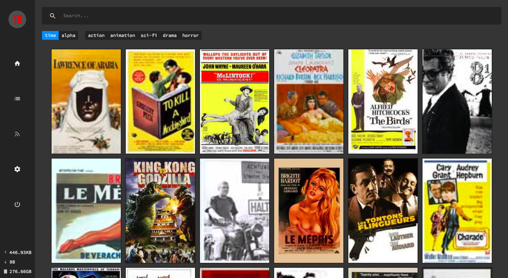
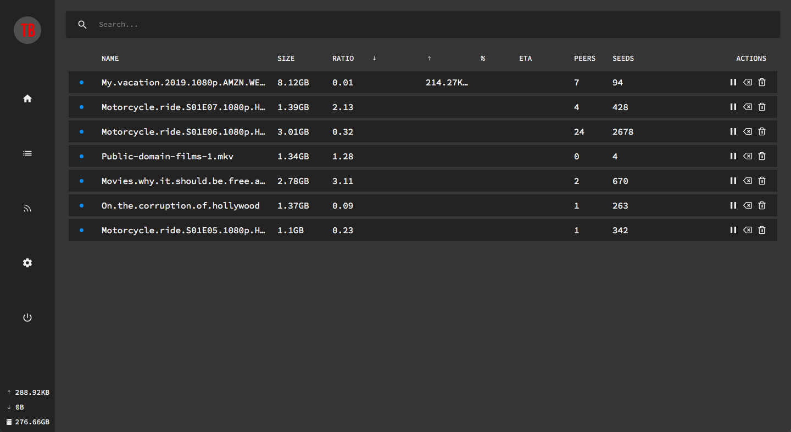

# TorrBoard

> A complete experience for your (legal) torrents

Media browser, torrent manager, RSS list with optional automated downloads.
Includes authentication and invite system.





### Installation

- Deluge
- Mongo
- Node (11)
- Nginx (because Apache is so 2007), serving deluge and files (doing so in http avoids handshake lag)

You will probably have to figure out a bunch of stuff by yourself though, and there's
some hardcoded variables, but nobody is ever going to try this so why bother?

### .env

```
RSS_URL={rssUrl}
OMDB={omdbKey}
DELUGE={pass}:{host}
YOUTUBE={apiKey}
JWT_SECRET={secret}
SENDGRID={apiKey}
